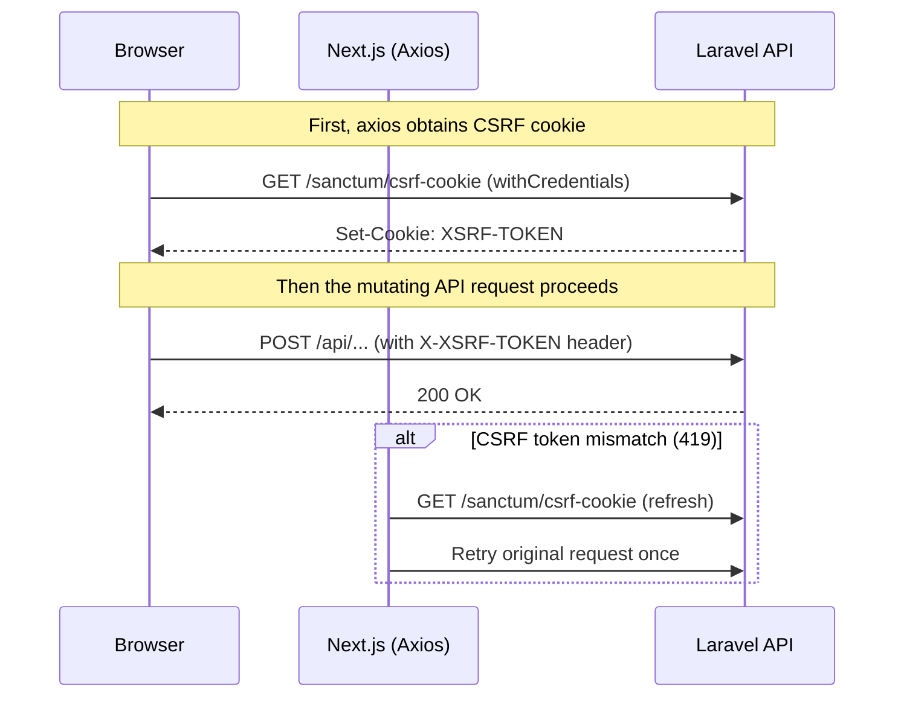
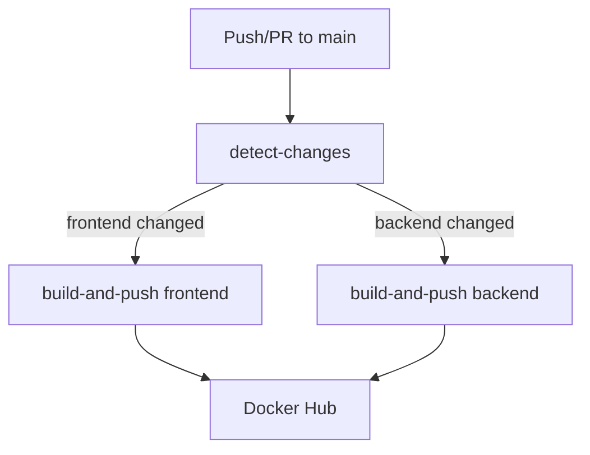
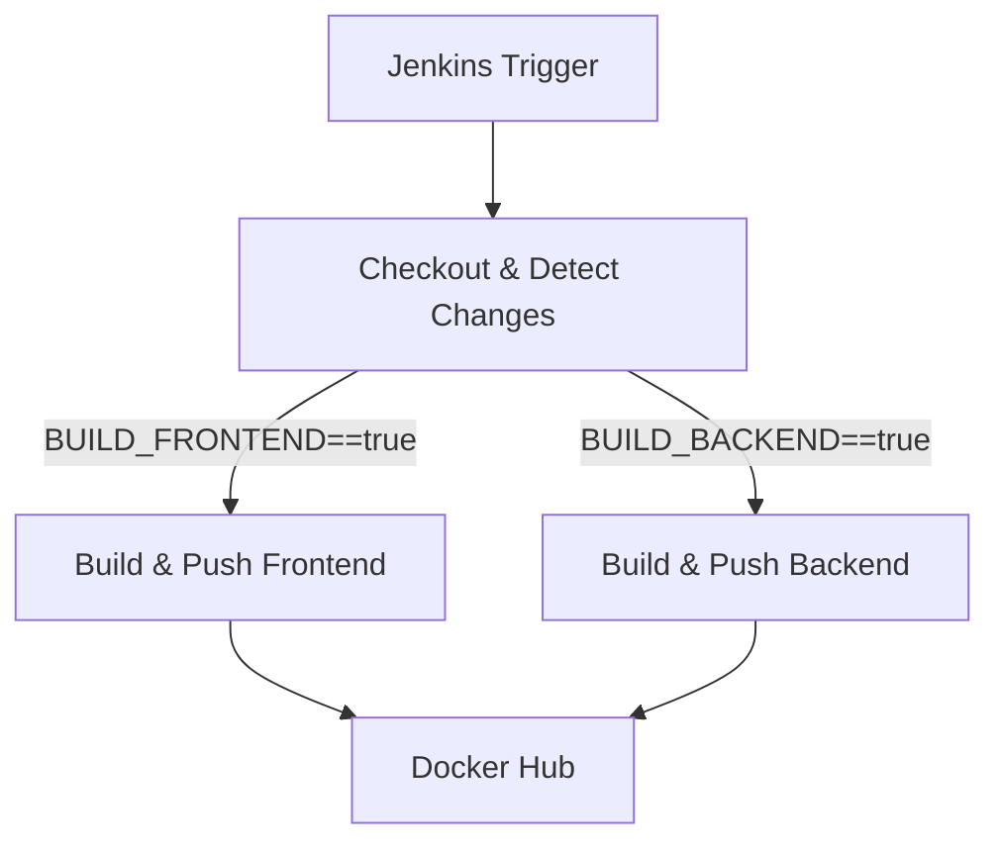

# Project Documentation (Frontend, Backend, Database, CI/CD)

This repository contains a fixed implementation of a full‑stack application consisting of:
- Frontend: Next.js (Node.js)
- Backend: Laravel 11 (PHP) with Sanctum for session/CSRF
- Database: MySQL 8
- CI/CD: GitHub Actions and Jenkins pipelines that build and push Docker images

Note: Infrastructure and unrelated bash scripts have been intentionally disregarded in this documentation, except CI/CD definitions (GitHub Actions and Jenkins) which are documented below as requested.

## Repository Structure

- front-end/ — Next.js application (port 3000)
- back-end/ — Laravel API (port 5000)
- database/ — Optional MySQL compose snippet for DB only
- compose.yml — Full local dev stack (MySQL + Backend + Frontend)
- .github/workflows/main_cicd.yml — GitHub Actions pipeline
- Jenkinsfile — Jenkins pipeline
- broken/ — Original broken code for reference/comparison

Key ports
- Frontend: 3000
- Backend API: 5000
- MySQL: 3306

## Running Locally

Two options are supported:

1) Docker Compose (recommended for parity)
- Prerequisites: Docker and Docker Compose
- Command:
  - docker compose -f compose.yml up --build
- Services:
  - mysql (MySQL 8)
  - backend (Laravel API at http://localhost:5000)
  - frontend (Next.js at http://localhost:3000)

2) Manual (without Docker)
- Backend (Laravel):
  - cp back-end/.env.example back-end/.env
  - Update DB_ variables to point to your MySQL
  - From back-end/: composer install
  - php artisan key:generate
  - php artisan migrate
  - php artisan serve --host=0.0.0.0 --port=5000
- Frontend (Next.js):
  - cp front-end/.env.local.example front-end/.env.local (see env vars below; if the example file is missing, create .env.local with values in the Environment Variables section)
  - From front-end/: npm install --legacy-peer-deps
  - npm run dev

## Environment Variables

Frontend (front-end/.env or .env.local)
- NEXT_PUBLIC_BACKEND_URL: Backend URL reachable from the browser (e.g., http://localhost:5000)
- BACKEND_API_HOST: Backend URL reachable from the frontend server runtime (SSR inside the container). In Docker, use the backend service name (e.g., http://clms-backend:5000)
- SECRET_COOKIE_PASSWORD: A strong 32+ bytes secret for iron-session

Backend (back-end/.env)
- DB_CONNECTION: mysql
- DB_HOST: mysql (when using compose) or 127.0.0.1 (when running locally without Docker)
- DB_PORT: 3306
- DB_DATABASE: clms_db
- DB_USERNAME: clms_user
- DB_PASSWORD: clms_password
- SANCTUM_STATEFUL_DOMAINS: localhost,localhost:3000,127.0.0.1:3000,clms-frontend,clms-frontend:3000
- SESSION_DOMAIN: null (for Docker/local dev, to avoid cookie domain mismatches)

Important Docker note
- In compose.yml, BACKEND_API_HOST for the frontend must point to the backend container name (http://clms-backend:5000) for SSR calls. If set to http://localhost:5000 inside the frontend container, SSR requests will fail because they resolve to the frontend container itself. The provided front-end/.env already uses http://clms-backend:5000.
- VITE_API_URL and NEXT_PRIVATE_BACKEND_HOST are currently unused by the Next.js code; prefer NEXT_PUBLIC_BACKEND_URL and BACKEND_API_HOST.

## Backend (Laravel 11) Overview

Key packages
- laravel/sanctum: Session and CSRF protection for SPAs
- spatie packages (activitylog, medialibrary, permission) installed in composer.json
- maatwebsite/excel for exports

Key endpoints (back-end/routes/api.php)
- GET /api/health — simple health check
- POST /api/login — AuthenticationController@login
- POST /api/logout — AuthenticationController@logout (auth:sanctum)
- POST /api/password/forgot — PasswordResetController@forgotPassword
- POST /api/password/reset — PasswordResetController@resetPassword
- Protected (auth:sanctum):
  - PATCH /api/users/{user}/change-password — AuthenticationController@changePassword
  - PATCH /api/users/{user} — UserController@update
  - /api/admin/users — UserController resource routes

CORS and Sanctum
- back-end/config/cors.php
  - paths include api/* and sanctum/csrf-cookie
  - supports_credentials: true (required for cookies)
  - allowed_origins: includes localhost:3000 and clms-frontend; do not leave "*" in production when using credentials
- back-end/config/sanctum.php
  - stateful domains configured via SANCTUM_STATEFUL_DOMAINS
- back-end/bootstrap/app.php
  - Adds EnsureFrontendRequestsAreStateful middleware for API requests
  - Adds CORS alias middleware

Docker image (back-end/Dockerfile)
- php:8.3-fpm, installs composer deps, runs php artisan key:generate
- Serves on port 5000 (php artisan serve)

Database (back-end/config/database.php)
- Default is read from DB_CONNECTION (mysql in .env)
- MySQL connection parameters come from .env

## Frontend (Next.js) Overview

Key libraries
- next, react, react-dom
- next-iron-session for session management across SSR
- axios for HTTP, with custom interceptors for CSRF handling
- tailwindcss + daisyui + nprogress + styled-components

Axios configuration (front-end/lib/axios.js)
- Picks baseURL depending on runtime:
  - Browser: NEXT_PUBLIC_BACKEND_URL
  - SSR/server: BACKEND_API_HOST
- Enables withCredentials for cookie-based CSRF/session
- Intercepts mutating requests to ensure the CSRF cookie has been fetched from /sanctum/csrf-cookie
- On 419 (CSRF mismatch), auto-refreshes CSRF cookie and retries once

Session wrapper (front-end/lib/session.js)
- withIronSession using SECRET_COOKIE_PASSWORD and cookieName clm.mw

Auth helpers (front-end/lib/middleware.js)
- Provides SSR guards that redirect unauthenticated users and build a configBundle for pages
- Fixed to avoid sending an Authorization header with an undefined token

Debug utilities
- front-end/pages/debug-csrf.js — a tool to test CSRF cookie handshake and API calls during development

Docker image (front-end/Dockerfile)
- node:18-alpine, installs deps, runs npm run dev on port 3000

## Database Details

MySQL service (compose.yml)
- Image: mysql:8.0
- Database: clms_db
- User: clms_user
- Password: clms_password
- Port: 3306

Initialization
- From inside the backend container or your local machine:
  - php artisan migrate
  - php artisan db:seed (if/when seeders are added)

## CSRF Flow (Sanctum)

## What Was Broken vs Fixed

This section highlights the key issues found in broken/ and how they were fixed in the current code.

Backend
- routes/api.php
  - Broken: Route controller references used [class, 'login'] and [class, 'logout'] which is invalid and causes runtime errors.
  - Fixed: Corrected to [AuthenticationController::class, 'login'] and [AuthenticationController::class, 'logout'].
- bootstrap/app.php
  - Broken: Missing Sanctum middleware to treat SPA requests as stateful; missing CORS alias.
  - Fixed: Added EnsureFrontendRequestsAreStateful for API routes and an alias for Fruitcake\Cors middleware.
- config/cors.php
  - Broken: supports_credentials was false and allowed_origins was '*', preventing cookies from being included on cross‑site requests when using credentials (required by Sanctum).
  - Fixed: supports_credentials set to true and allowed_origins updated to include localhost:3000 and clms-frontend. Note: remove '*' in production when credentials are required.
- .env / environment
  - Improved: SANCTUM_STATEFUL_DOMAINS expanded to include local hostnames/ports and Docker service names for consistent cookie behavior across SSR/CSR and containers.
  - Improved: DB_HOST set to mysql when using Docker to align with compose service name.

Frontend
- Missing robust CSRF handling
  - Broken: No axios client ensuring Sanctum CSRF cookie handshake before mutating requests, leading to 419 errors.
  - Fixed: front-end/lib/axios.js with interceptors that fetch /sanctum/csrf-cookie as needed and retry once on 419.
- Environment variable usage for SSR vs browser
  - Broken: No clear split between server/runtime URL and browser URL for API.
  - Fixed: Uses BACKEND_API_HOST for SSR (container network) and NEXT_PUBLIC_BACKEND_URL for browser (host network).
- Authorization header when token absent
  - Broken: Always set Authorization header using a possibly undefined token ("Bearer undefined") in some SSR helpers.
  - Fixed: Conditioned Authorization header on presence of api_token in front-end/lib/middleware.js.
- Developer tooling
  - Added: front-end/pages/debug-csrf.js to help trace and fix CSRF issues during development.

Compose and Env Notes
- Ensure FRONTEND SSR calls use http://clms-backend:5000 via BACKEND_API_HOST (in container).
- Variables like VITE_API_URL and NEXT_PRIVATE_BACKEND_HOST are not used by the Next.js code and can be removed or ignored.

## CI/CD

### GitHub Actions (.github/workflows/main_cicd.yml)

Workflow summary
- Triggers on push and pull_request to main for files in front-end/** and back-end/**
- Job detect-changes: determines whether frontend and/or backend changed
- Job build-and-push: matrix builds for frontend and backend, respects detect-changes outputs
- Docker tags
  - PRs: pr-<number>
  - Pushes: <commit-sha> and latest

Required secrets
- DOCKER_HUB_USERNAME
- DOCKER_HUB_TOKEN

Environment variable
- DOCKER_HUB_REPO (repository base; images push to DOCKER_HUB_REPO-frontend and DOCKER_HUB_REPO-backend)

### Jenkins (Jenkinsfile)

Pipeline summary
- Stage: Checkout and Detect Changes
  - Checks out full history and diffs against previous commit or PR base
  - Sets BUILD_FRONTEND and BUILD_BACKEND environment flags
- Stage: Build and Push Docker Images
  - Conditionally builds frontend and/or backend images
  - Tags PR builds as pr-<CHANGE_ID>; push builds as <GIT_COMMIT> and latest
  - Docker Hub login uses Jenkins credentialsId: docker-hub-credentials

Required Jenkins credentials
- docker-hub-credentials (Username + Password/Token)

## Troubleshooting

- CSRF 419 errors
  - Ensure NEXT_PUBLIC_BACKEND_URL and BACKEND_API_HOST are set correctly.
  - Confirm supports_credentials=true in back-end/config/cors.php.
  - Verify SANCTUM_STATEFUL_DOMAINS includes your hostnames/ports.
  - Use /debug-csrf page to test CSRF cookie handshake.

- SSR cannot reach API in Docker
  - BACKEND_API_HOST must be http://clms-backend:5000 when using compose.

- Database connection errors
  - Ensure DB_HOST is mysql when using compose (service name), and credentials match compose.yml.
  - Wait for mysql service to become healthy before backend starts (compose handles this via depends_on + healthcheck).

## Appendix: File Pointers

- Frontend
  - front-end/lib/axios.js — Axios + CSRF interceptors
  - front-end/lib/middleware.js — SSR guards and configBundle
  - front-end/pages/debug-csrf.js — CSRF debug utilities
  - front-end/.env(.local) — Browser vs SSR API URLs

- Backend
  - back-end/bootstrap/app.php — Middleware configuration (Sanctum + CORS alias)
  - back-end/config/cors.php — CORS with credentials enabled
  - back-end/config/sanctum.php — Stateful domains & middleware
  - back-end/routes/api.php — API routes (login, logout, password, admin/users)
  - back-end/.env — MySQL and Sanctum configuration

- CI/CD
  - .github/workflows/main_cicd.yml — GitHub Actions pipeline
  - Jenkinsfile — Jenkins pipeline

---

